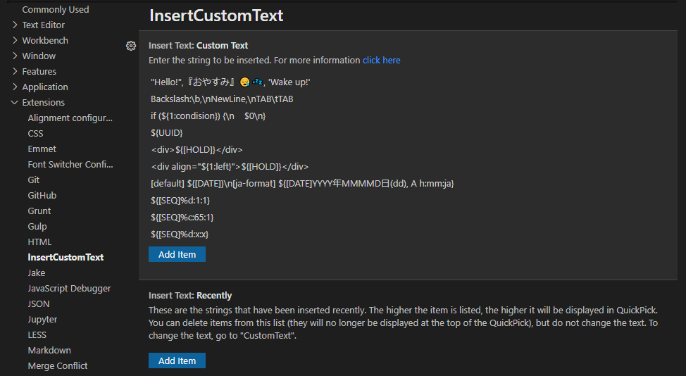
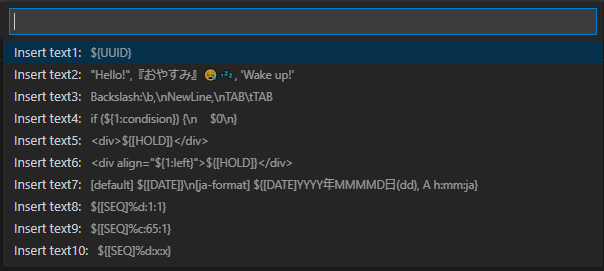
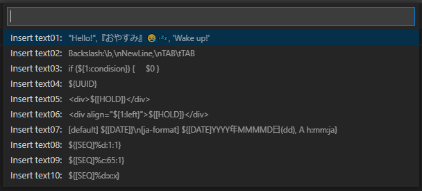
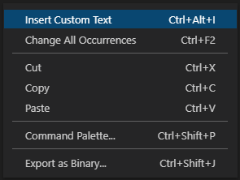

## 2.0.0
`[en]`
* The settings for characters to be inserted are now in list format, and there is no longer a limit to the number of items. 
  
* Previously inserted text is now displayed at the top of the QuickPick list. 
  

`[jp]`
* 挿入する文字の設定が、リスト形式になり、アイテムの上限がなくなりました。 
  
* 過去に挿入したテキストが、QuickPickのリストの上位に表示されるようになりました。 
  

## 1.0.0
`[en]`
* The information about the text to be inserted is now easier to understand. 
  
* The context menu is now one of "Insert Custom Text". 
  
* The shortcut key is now only "Ctrl+Alt+I".

`[jp]`
* 挿入する文字の情報が分かりやすくなりました。 
  
* コンテキストメニューは、"Insert Custom Text"の1つになりました。 
  
* ショートカットキーが、"Ctrl+Alt+I"のみになりました。

## 0.0.2
`[en]`
* Fixed broken display of README.

`[jp]`
* READMEの表示が崩れていたのを修正しました。

## 0.0.1
`[en]`
* New Release

`[jp]`
* 新規リリース
