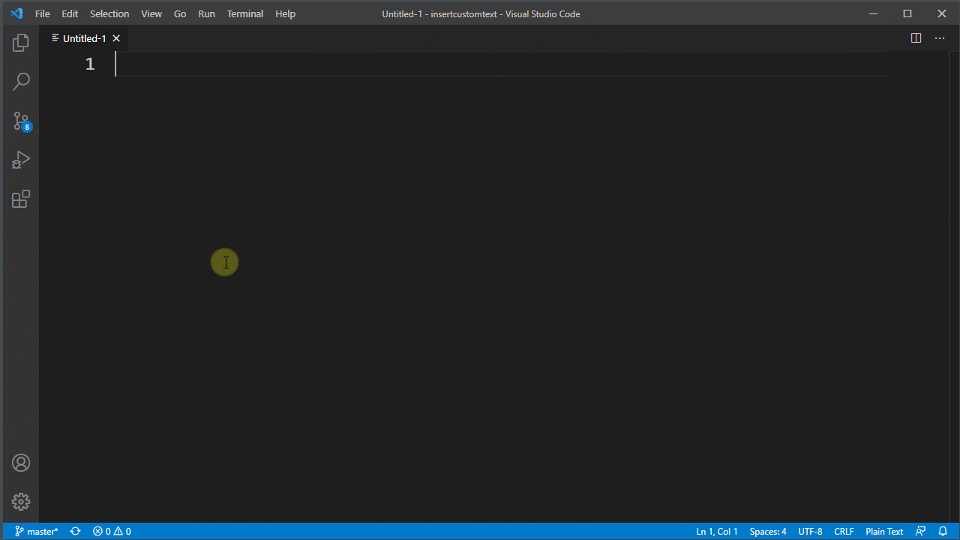
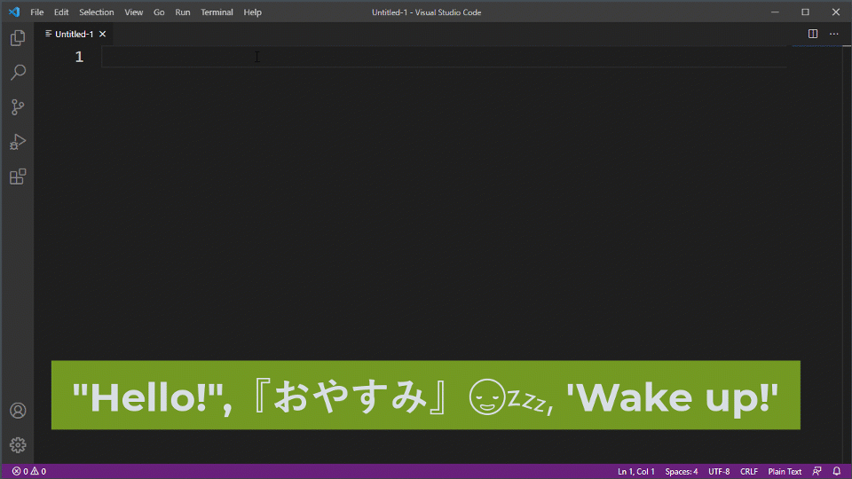
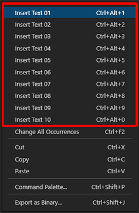

# Insert Custom Text Quickly README

Documentation for each language
* [:jp: 日本語版](https://github.com/TatsuyaNakamori/vscode-InsertCustomTextQuickly/blob/master/README.jp.md)

\* If the table appears collapsed, please see the readme on GitHub [[GitHub Readme](https://github.com/TatsuyaNakamori/vscode-InsertCustomTextQuickly)]

## Overview.

* **Insert user-defined text.**
  * Inserting 2-byte characters (Japanese, emoji, etc.).
  * Support for snippet syntax ("`$0`", "`${1:code}`", "`${UUID}`", etc.)
  * Support for escape characters (such as "`\n`", "`\t`")
  * Inclusion of selected strings ("`${[HOLD]}`" keyword).
  * Insert date and time using the "`${[DATE]}`" keyword.
  * Inserting sequential numbers of numbers or characters using the "`${[SEQ]}`" keyword.

## License

Copyright (c) 2021 Tatsuya Nakamori 
MIT License

## Donation

Because Japanese law prohibits money transfers between individuals, the transaction is handled under the category of "purchase". Therefore, please be aware that you may not be able to receive tax benefits in your country.

## How to use

1. Open `Settings(Ctrl+,)` and select the "`Insert Custom Text Quickly`" item.
1. Enter the text you want to insert into the `Text01` to `Text10` fields. 
  
1. Right-click in the editor and select the "`Insert Text 01`"～"`Insert Text 10`" menu item. (By default, the shortcuts [`Ctrl+Alt+1`]～[`Ctrl+Alt+0`] are set, so you can also access them from the shortcuts.) 
  

## How to set up

|Settings|Result|Description|
|---|---|---|
|"Hello!",『おやすみ』😪💤, 'Wake up!'|"Hello!",『おやすみ』😪💤, 'Wake up!'|Allows you to enter 2-byte characters (e.g. Japanese) and emoji.|
|Backslash:`\b`,`\n`NewLine,`\n`TAB`\t`TAB|Backslash:\\, NewLine, TAB&emsp;TAB|Each escape string is supported. [`\b`(`\\`): Backslash], [`\t`: Tab], [`\r`: Carriage Return], [`\n`: Line Feed].　[[Details](#escape-character)]|
|if (`${1:condision}`) {`\n`&nbsp;&nbsp;&nbsp;&nbsp;`$0\n`}|if (condision) { &nbsp;&nbsp;&nbsp;&nbsp; }|You can use the Snippets format. ([VSCode Snippets](https://code.visualstudio.com/docs/editor/userdefinedsnippets))|
|`${UUID}`|6ca25d87-2b09-4190-9454-f2ad52b9bb5f|The `${UUID}` keyword generates a UUID version 4. (part of VSCode's Snippets feature)|
|\
`${[HOLD]}`\
|\
`SELECTED_TEXT`\
|The `${[HOLD]}` keyword can be used to insert the currently selected character.|
|\
`${[HOLD]}`\
|\
`SELECTED_TEXT`\
|You can combine the `${[HOLD]}` keyword with Snippets formatting.|
|[default] `${[DATE]}`\n[ja-format] `${[DATE]YYYY年MMMMD日(dd), A h:mm:ja}`|[default] 2021-02-10T20:55:06+09:00 [ja-format] 2021年2月10日(水), 午後 8:55|The `${[DATE]}` keyword can be used to insert a date \"`[DATE]`\" followed by a format or locale can be set. [[Details](#About-the-${[DATE]}-keyword)]|
|`${[SEQ]%d:1:1}`|1 2 3|The `${[SEQ]}` keyword can be used to insert a sequential number. (multiple selections are required) \"`[SEQ]`\" followed by \"`Format:Default:Step`\" can be set. [[Format Details](#About-formatting-(${[SEQ]}))]|
|`${[SEQ]%c:65:1}`|A B C|With the `${[SEQ]}` keyword, the \"`%c`\" format allows you to insert the letters of the alphabet in order. 65 for "A", 97 for "a". [[Details](#Correspondence-between-numbers-and-letters-in-"`%c`"-format-(${[SEQ]}))]|
|`${[SEQ]%d:x:x}` (Setting up the input box: `2:2`)|2 4 6|In the `${[SEQ]}` option, if you specify \"`x`\" as the initial value and step, an input dialog will be displayed. You can specify the initial value and step value at runtime.|

## Escape character

* Backslashes can be combined with certain characters to give them special meanings.

  |Symbols|Meaning|
  |---:|---|
  |\t|Tab|
  |\r|Carriage Return|
  |\n|Line Feed|
  |\b (\\\\)|Backslash|

## About the ${[DATE]} keyword

* **${[DATE]}** keyword can be used to insert information about the current date.
* After **[DATE]**, you can specify the output format and locale.
  * By using the format format, you can retrieve information such as year, month, day, hour, minute, second, etc.
  * Use a colon to separate the format and locale. (**${[DATE]`YYYY/M/D:ja`}**)
* The following table gives an overview of the formats. For more detailed information, please refer to the following document. [ [Format](https://day.js.org/docs/en/display/format) ] [ [Localized formats](https://day.js.org/docs/en/display/format#list-of-localized-formats) ] [ [AdvancedFormat](https://day.js.org/docs/en/plugin/advanced-format) ]

  |Format|Result|Description|
  |---|---|---|
  |${[DATE]}|2021-02-11T12:49:59+09:00|If you don't specify anything, you will get results like the one on the left with VisualStudioCode locale|
  |${[DATE]`YYYY/M/D`}|2021/2/11|where `YYYY` is the 4-digit year, `M` is the month, and `D` is the day. You can also use `YY`, `MM`, and `DD` for two-digit justification. [ [Format](https://day.js.org/docs/en/display/format) ]|
  |${[DATE]`dddd`}|Thursday|`ddddd` will output the day of the week.|
  |${[DATE]`dddd`:`ja`}|木曜日|If the locale is `ja`, the day of the week will be printed in Japanese.|
  |${[DATE]`A h:m:s`}|PM 1:1:30|`A` for AM PM, `h` for hours (12-hour system), `m` for minutes, and `s` for seconds.|
  |${[DATE]`LLLL`}|Thursday, February 11, 2021 1:04 PM|Use the special symbol "`LLLL`" to apply a pre-defined format depending on the locale. [ [Localized formats](https://day.js.org/docs/en/display/format#list-of-localized-formats) ]|
  |${[DATE]`LLLL`:`ja`}|2021年2月11日 木曜日 13:04|If the locale is set to "`ja`", it will be written in Japanese.|
  |${[DATE]`[Quarter:] Q, [Do:] Do`}|Quarter: 1, Do: 11th|[ [AdvancedFormat](https://day.js.org/docs/en/plugin/advanced-format) ] can be used to output quarters and days in ordinal notation.Also, if you enclose characters such as "`Do`" and "`YYYY`" in square brackets (`[]`), you can output the characters as they are, without converting them to dates.|
  |${[DATE]`[Quarter:] Q, [Do:] Do`:`ja`}|Quarter: 1, Do: 11日|If you set the locale to " `ja`", it will be written in Japanese, like "`11日`".|

* Locale can specify the following regions.
* If you do not specify a locale, the information of the language used by Visual Studio Code will be used.  "`en`" will be applied for the default English language, and "`ja`" will be applied if the environment is set to Japanese.

  |Locale symbol|Language||Locale symbol|Language||Locale symbol|Language
  |---:|---|---|---:|---|---|---:|---|
  |en|English (USA)||it|Italian||bg|Bulgarian|
  |zh-cn|Simplified Chinese||es|Spanish||hu|Hungarian|
  |zh-tw|Traditional Chinese||ja|Japanese||pt-br|Portuguese (Brazil)|
  |fr|French||ko|Korean||tr|Turkish|
  |de|German||ru|Russian|

## About ${[SEQ]} keyword

* If you have multiple text cursors, you can insert a sequence of numbers or characters in the order each cursor is selected.
* `[SEQ]` followed by `format:initial:step`.
* `Format` allows you to convert the specified number to hexadecimal or ASCII characters.
* `Initial value` specifies the first number. You can also specify a decimal point or other value.
* `Step` is a number other than 1, if you want to skip a number or something.
* If you set the format to `%d`, the initial value to `1`, and the step to `2` ("${[SEQ]`%d:1:2`}"), you will get the result "1, 3, 5, 7...". The result will be.
* If you set the initial value and step to "`x`" (e.g. "${[SEQ]`%d:x:x`}"), an input dialog will appear before inserting the number, and you can enter the initial value and step.  (Use this for cases where the initial value/step changes depending on the situation.)

### About formatting (${[SEQ]})

  * Use the "printf" conversion specifier, which is commonly used in programming languages.

    |Format (conversion specifier)|Meaning|
    |---:|---|
    |%d|decimal notation|
    |%02d| If "02" is specified between "%" and "d", it will be converted to two-digit decimal notation (01, 02, ...). |%o
    |%o|converts to octal notation|
    |%x|converts to hexadecimal (the letter "abcdef" will be lowercased)|
    |%X|converts to hexadecimal (character "ABCDEF" will be uppercase)|%f|converts to floating point (decimal)
    |%f|display floating point (real number)|%.2f|"abcdef" will be in lower case)
    |%.2f|Justify the decimal point to two digits by specifying ".2" between "%" and "f".
    |%3.2f|"3.2" between "%" and "f" will align the integer part to 3 digits and the decimal part to 2 digits|
    |%e|Print real numbers in exponential format|
    |%c|converts to ASCII characters of the specified number [ [Details](#Correspondence-between-numbers-and-letters-in-"`%c`"-format-(${[SEQ]})) ]|

### Correspondence between numbers and letters in "`%c`" format (${[SEQ]})

* You can insert alphabets in order starting from A by specifying `${[SEQ]%c:65:1}`.
* If you want to start with the lowercase letter a, specify `${[SEQ]%c:97:1}`.

    |Num|Chr||Num|Chr||Num|Chr||Num|Chr
    |---|---|---|---|---|---|---|---|---|---|---|
    |65|A||78|N||97|a||110|n|
    |66|B||79|O||98|b||111|o|
    |67|C||80|P||99|c||112|p|
    |68|D||81|Q||100|d||113|q|
    |69|E||82|R||101|e||114|r|
    |70|F||83|S||102|f||115|s|
    |71|G||84|T||103|g||116|t|
    |72|H||85|U||104|h||117|u|
    |73|I||86|V||105|i||118|v|
    |74|J||87|W||106|j||119|w|
    |75|K||88|X||107|k||120|x|
    |76|L||89|Y||108|l||121|y|
    |77|M||90|Z||109|m||122|z|

## Known Issues / Future Updates

1. it is difficult to know what kind of text to insert when showing the command of this extension in the context menu or command palette. This is due to a limitation of the Visual Studio Code API that prevents you from changing the menu label. We are looking into a mechanism to make it easier to know what kind of text you are trying to insert.   
1. I'm thinking of adding a feature that would allow me to insert random characters.
1. we are thinking of extending the functionality of `${[SEQ]}`.

## Release Notes

### 0.0.2
* Fixed broken display of README.

### 0.0.1
* New Release

